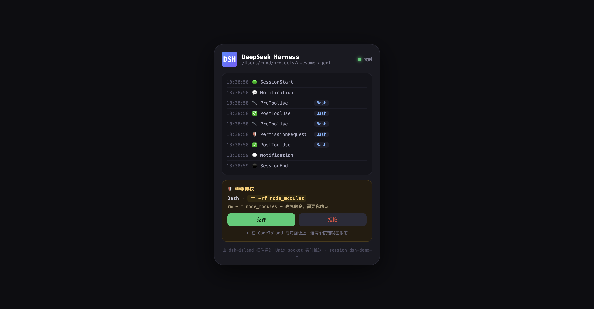
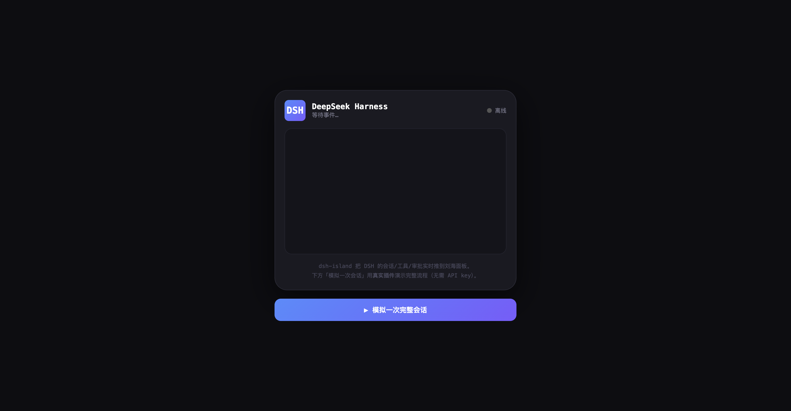

<p align="center">
  
</p>

# dsh-island

> 把 DeepSeek Harness（DSH）agent 的实时状态推送到 [CodeIsland](https://github.com/wxtsky/CodeIsland) 的 macOS 刘海面板 —— 会话、工具调用、审批、回复全在 Dynamic Island 上一目了然。

## 这是什么

[CodeIsland](https://github.com/wxtsky/CodeIsland) 是一个运行在 MacBook 刘海区域的实时 AI 编码代理状态面板，通过 Unix socket 接收 Claude Code / Codex / Gemini CLI / Cursor 等 14 个工具的 hook 事件。

**dsh-island** 是 DSH 生态侧的桥接插件：DSH 是插件化运行时，天然没有"hook 配置文件"这回事，所以本插件直接**监听 DSH 内置事件**，把归一化的事件写入 CodeIsland 的 Unix socket —— 无需修改任何工具配置，装插件即用。

```
DSH Agent
  → session/created · tools/pre-execute · approval/request · …
    → dsh-island 插件（本仓库）
      → Unix socket /tmp/codeisland-<uid>.sock
        → CodeIsland 刘海面板实时渲染
          → 批准/拒绝直接在面板上点
```

## 功能

- **会话状态**：`SessionStart` / `SessionEnd` 跟随 DSH 会话生命周期
- **工具调用**：`PreToolUse` / `PostToolUse` / `PostToolUseFailure` 实时展示 agent 正在执行的工具与参数
- **面板审批**：`approval/request` → CodeIsland 的 `PermissionRequest` 审批卡，**在刘海面板上直接批准/拒绝**，决策回传给 DSH
- **子代理**：`SubagentStart` / `SubagentStop`
- **状态变化**：`agent/status` → 面板提示
- **零侵入**：不修改任何 DSH / CodeIsland 配置，不拦截、不改写工具决策

## 事件映射

| DSH 事件 | CodeIsland 事件 | 方向 |
|---|---|---|
| `session/created` | `SessionStart` | 通知 |
| `session/disposed` | `SessionEnd` | 通知 |
| `tools/pre-execute` | `PreToolUse` | 通知 |
| `tools/post-execute` | `PostToolUse` / `PostToolUseFailure` | 通知 |
| `approval/request` | `PermissionRequest` | **阻塞 · 双向**（面板决策回写 DSH） |
| `subagent/start` | `SubagentStart` | 通知 |
| `subagent/end` | `SubagentStop` | 通知 |
| `agent/status` | `Notification` | 通知 |

> 事件发送对 DSH 是**旁路观察**：`PreToolUse` / `PostToolUse` 监听器总是调用 `next()` 放行，发送失败也不影响 agent 执行。唯一会"停留等待"的是 `approval/request` —— 这是审批的语义本身。

## 安装

```bash
dsh plugin --profile <profile> add github:cdxiaodong/dsh-island
```

前提：本机已运行 [CodeIsland](https://github.com/wxtsky/CodeIsland)（刘海面板应用），并已安装到 **支持列表之外** 的 source。见下文「让 CodeIsland 识别 DSH」。

## 配置

```typescript
interface Config {
  socketPath?: string        // CodeIsland socket 路径（默认 /tmp/codeisland-<uid>.sock）
  source?: string            // 上报的 source 标识（默认 dsh）
  approvalTimeoutMs?: number // 审批等待面板决策超时（默认 5 分钟）
  approvals?: boolean        // 是否把审批转发给面板（默认 true）
  subagents?: boolean        // 是否上报子代理事件（默认 true）
  agentStatus?: boolean      // 是否上报 agent 状态（默认 true）
  debug?: boolean            // 打印发送日志（默认 false）
}
```

```typescript
// 只上报工具调用，不参与审批
export function apply(ctx: Context) {
  ctx.plugin(dshIsland, { approvals: false })
}
```

## 让 CodeIsland 识别 DSH

CodeIsland 会丢弃 `_source` 不在其支持列表内的事件。要看到 DSH 卡片，需在 CodeIsland 侧加入 `dsh` source —— 见 [wxtsky/CodeIsland#新增 DSH 支持](https://github.com/wxtsky/CodeIsland)。

在 CodeIsland 合并之前，可用自定义 CLI 配置手动注册（CodeIsland 设置 → Hooks → Custom CLIs）：

```json
{ "name": "DeepSeek Harness", "source": "dsh" }
```

## 开发

```bash
npm install
npm run build        # tsc → lib/
npm test             # node --test，8 个用例
npm run demo         # 模拟完整 DSH 会话 → 生成 docs/demo-panel.html + 截图
node scripts/mock-codeisland.mjs   # 无 CodeIsland 应用时的 socket 接收端演示
```

测试用 `@deepseek-ai/cordis` 兼容语义的 `cordis` Context 精确模拟 DSH 宿主的事件通道（`tools/*`、`approval/request` 均按宿主真实 waterfall 签名 `(exec, next)` 调用）。

## 无 CodeIsland 应用的演示

**实时可视化面板**（推荐）：无需 API key，点一下按钮用真实插件跑完整会话。

```bash
node scripts/live-panel.mjs          # → http://127.0.0.1:3081
```

浏览器打开面板，点「▶ 模拟一次完整会话」即可看到 SessionStart → 工具调用 → 高危命令审批卡 → SessionEnd 全流程实时渲染。面板同时监听 CodeIsland socket——若你正在运行真实 DSH（配好模型后发消息），事件也会实时进面板。



**命令行 mock 接收端**：只打印事件流。

```bash
node scripts/mock-codeisland.mjs     # 终端实时打印事件

# 终端 2：启动 DSH 并发消息，终端 1 会实时打印
dsh web
```

## 参考

- [CodeIsland](https://github.com/wxtsky/CodeIsland) —— 刘海面板，Unix socket 接收端
- [dsh-guardian](https://github.com/cdxiaodong/dsh-guardian) —— 同生态的安全护栏插件，本插件的脚手架参考

## License

MIT
